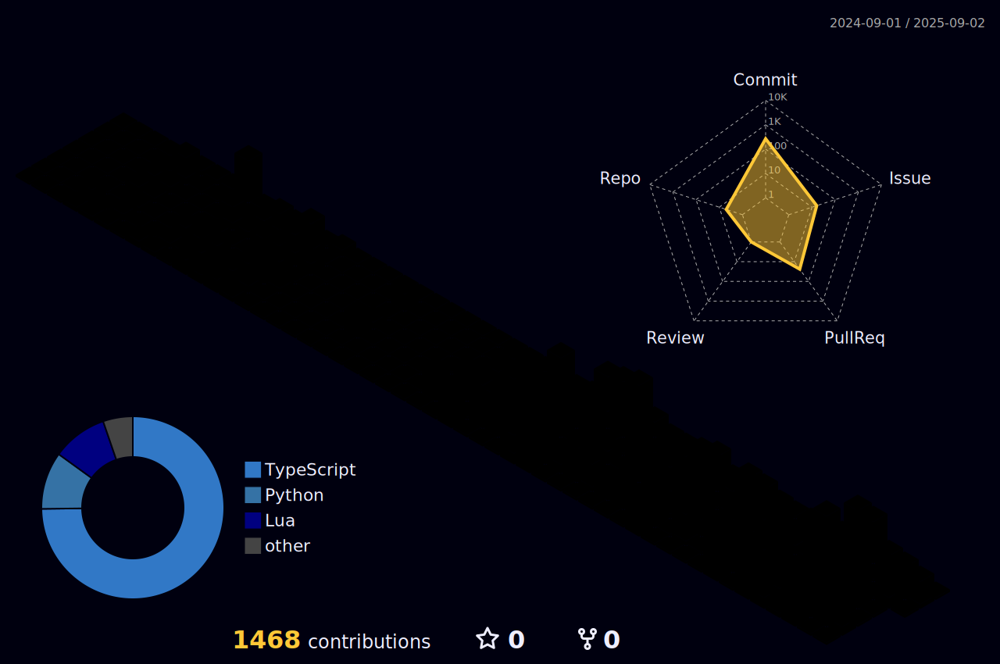

<!---
keu-5/keu-5 is a ✨ special ✨ repository because its `README.md` (this file) appears on your GitHub profile.
You can click the Preview link to take a look at your changes.
--->

  

 

  

 

  

